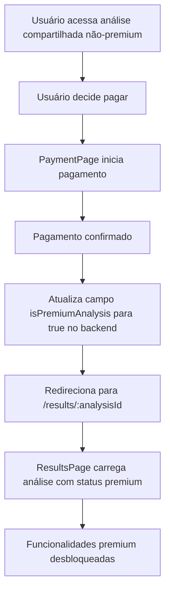

# Plano para Correção da Integração Premium após Pagamento

## Contexto do Problema

Após o pagamento para desbloquear funcionalidades premium, o usuário é redirecionado para a área premium, mas esta parece desconectada da análise original, sem dados carregados. Isso ocorre porque o status premium não está sincronizado com a análise, causando inconsistência na experiência.

---

## Solução Proposta

### Objetivo

- Atualizar o status da análise para premium no backend após o pagamento.
- Redirecionar o usuário para a página de resultados da análise (`/results/:analysisId`).
- Garantir que a página de resultados carregue a análise com funcionalidades premium desbloqueadas.

---

## Passos Detalhados

### 1. Atualizar o status premium no backend

Após a confirmação do pagamento, o sistema deve:

- Atualizar o documento da análise no Firestore (ou backend equivalente), alterando o campo:

```json
{
  "isPremiumAnalysis": true
}
```

- Exemplo de código (Firebase):

```js
import { updateDoc, doc } from "firebase/firestore";

await updateDoc(doc(db, 'analyses', analysisId), {
  isPremiumAnalysis: true
});
```

---

### 2. Redirecionar para a página de resultados

- Após atualizar o backend, redirecionar o usuário para:

```
/results/{analysisId}
```

- Assim, a página de resultados poderá carregar a análise já com o status premium atualizado.

---

### 3. Carregar análise premium na ResultsPage

- A `ResultsPage` deve:

  - Carregar a análise pelo `analysisId`.
  - Verificar o campo `isPremiumAnalysis`.
  - Se `true`, liberar as funcionalidades premium (botões, análises IA, etc).

---

## Fluxo Revisado



---

## Benefícios da Solução

- **Experiência fluida:** O usuário permanece no contexto da análise original.
- **Consistência:** O status premium está vinculado à análise, evitando desconexão.
- **Facilidade de manutenção:** A lógica fica centralizada na página de resultados.

---

## Considerações Finais

- O campo `isPremiumAnalysis` deve estar presente no documento da análise.
- A atualização deve ocorrer **somente após confirmação do pagamento**.
- O contexto global pode ser atualizado opcionalmente para refletir o status premium, mas o essencial é a atualização no backend.

---