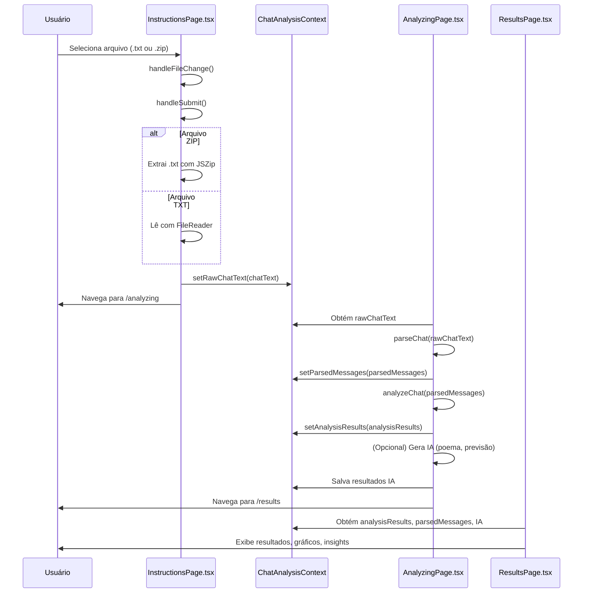

# Fluxo técnico detalhado do upload até a exibição dos resultados

---

## 1. Upload do arquivo na `InstructionsPage.tsx`

- **Componente:** `InstructionsPage`
- **Input:** `<input type="file" accept=".txt,.zip" onChange={handleFileChange} />`
- **Função:** `handleFileChange`
  - Valida extensão `.txt` ou `.zip`
  - Salva o arquivo no estado local `file`
- **Função:** `handleSubmit`
  - Se `.zip`:
    - Usa `JSZip` para extrair `.txt`
    - Lê o conteúdo do `.txt` extraído
  - Se `.txt`:
    - Usa `FileReader` para ler o conteúdo
  - **Resultado:** obtém `chatText` (string com o texto bruto do chat)
  - **Salva no contexto:** `setRawChatText(chatText)`
  - **Navega para:** `/analyzing`

---

## 2. Contexto global `ChatAnalysisContext`

- **Armazena:**
  - `rawChatText` (texto bruto)
  - `parsedMessages` (mensagens parseadas)
  - `analysisResults` (resultados da análise)
  - `aiPrediction`, `aiPoem`, etc.
- **Papel:** Compartilhar dados entre páginas

---

## 3. Página intermediária `/analyzing` (inferida)

- **Componente:** `AnalyzingPage`
- **Hooks:**
  - `useChatAnalysis()` para acessar `rawChatText` e setters
- **Processo:**
  - Ao montar, detecta `rawChatText`
  - Executa:
    - `parseChat(rawChatText)` → `parsedMessages`
    - `analyzeChat(parsedMessages)` → `analysisResults`
    - (Opcional) Gera insights IA (poema, previsão, análise de estilo)
  - Salva no contexto:
    - `setParsedMessages(parsedMessages)`
    - `setAnalysisResults(analysisResults)`
    - `setAiPrediction()`, `setAiPoem()`, etc.
  - Navega para `/results`

---

## 4. Página `ResultsPage.tsx`

- **Hooks:**
  - `useChatAnalysis()` para acessar dados do contexto
- **Renderiza:**
  - Estatísticas gerais
  - Gráficos (atividade, emojis)
  - Análises por participante
  - Insights IA
  - Fun facts e horóscopo do chat

---

## Diagrama Mermaid

---

## Resumo

- Upload do arquivo → leitura e extração do texto → salvar no contexto
- Página intermediária processa texto, gera análises e salva no contexto
- Página de resultados consome os dados e exibe as análises
